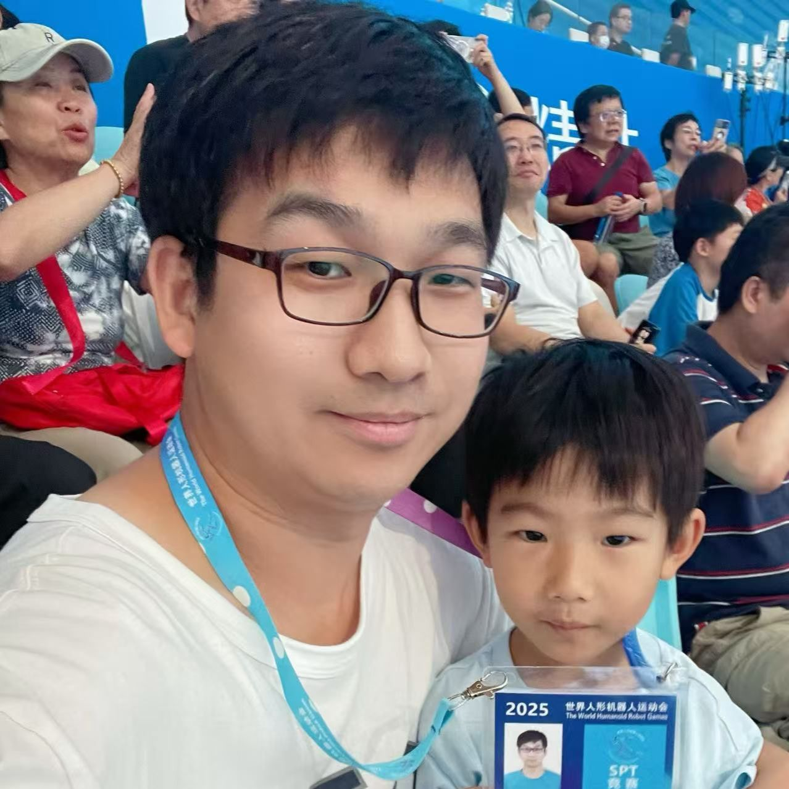

# Hi there 👋 I'm Shuai Shi (史帅)

  

## 🏢 About Me
- **🔭 Currently working at:** [Beijing Humanoid Robot Innovation Center](https://x-humanoid.com/)
- **👨‍🔬 Position:** Humanoid Robot Algorithm Engineer
- **🌱 Research Areas:** Mathematics, Imitation Learning, Reinforcement Learning, Human Object Interaction, Environment-aware Whole-body Control for Humanoid Robots
- **🎓 Education:** Chinese Academy of Sciences - Institute of Mathematics and Systems Science - Pure Mathematics
- **🏆 Awards:**
  - Three-time Finalist in Alibaba Global Mathematics Competition (2020, 2021, 2023)
  - National College Student Mathematics Competition (Mathematics Category) Chongqing Division Third Prize (2010) and First Prize (2012)
  - National High School Mathematics League Second Prize (2008)
  - Hebei Province High School Mathematics Competition First Prize (2008)

## 🔬 Research & Projects

### 📚 Research Papers
- **[MeshMimic: Geometry-Aware Humanoid Motion Learning through 3D Scene Reconstruction](https://arxiv.org/pdf/2602.15733)** (2026)
- **[Humanoid Occupancy: Enabling A Generalized Multimodal Occupancy Perception System on Humanoid Robots](https://arxiv.org/abs/2507.20217)** (2025)
- **[Occupancy World Model for Robots](https://www.arxiv.org/abs/2505.05512)** (May 2025)
- **[RoboOcc: Enhancing the Geometric and Semantic Scene Understanding for Robots](https://arxiv.org/abs/2504.14604)** (2025)

### 🚀 Projects
- **"Tiangang 2.0" Humanoid Robot Guide Project Perception Algorithm** (2025)
- **"[Tiangang" Humanoid Robot Autonomous Running Perception Algorithm](https://www.ncsti.gov.cn/kjdt/ztbd/2025sjrxjqrydh/202508/t20250819_216546.html) - Winner at 1st World Humanoid Robot Games** (2025)
  - 🥇 100m Champion
  - 🥈 400m Runner-up and 3rd place
  - 🥈 1500m Runner-up
  - 🥈 4×100m Relay Runner-up

## 📫 Get in Touch
Feel free to reach out for collaboration or discussion!

- **📧 Email:** [shuai_shi@sina.cn](mailto:shuai_shi@sina.cn) | [shuaishi1991@gmail.com](mailto:shuaishi1991@gmail.com)
- **🌐 Zhihu:** [My Zhihu Profile](https://www.zhihu.com/people/shuai_shi)
- **😺 GitHub:** [@shuaishi1991](https://github.com/shuaishi1991)
- **📝 Blog:** [Personal Blog](http://blog.shishuai.space/)

---

⭐ *"Mathematics is the language with which God has written the universe." - Galileo Galilei*

<!-- Social badges section -->
<!-- Badges with custom icons - https://github.com/shuaishi1991/custom-icon-badges -->
<!-- View counter - https://github.com/shuaishi1991/Simple-View-Counter -->

  
  

